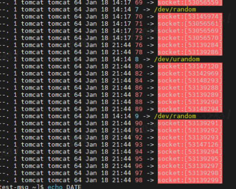

# 소켓에서 발생하는 에러가 Too Many Open Files인 이유

### 문제 발생

WebClient 를 사용하여 API통신을 하는 서버가 어느순간 요청을 Accept 하지 못하고 이후 어플리케이션이 종료되어버리는 이슈가 발생하였습니다.

로그를 확인해보니 Too Many Open Files 에러를 확인 할 수 있엇고 이것은 소켓을 사용하여 통신하는 WebClient에서 파일을 열어 통신을 한 뒤 닫지않는 이슈인것을 알게되었습니다.


소켓을 사용하여 통신을 하는데 왜 갑자기 파일이 나오는 거지?&#x20;

> 리눅스에서는 모든것을 파일로 관리합니다. 일반적으로 생각하는 파일 이외에 소켓, 디바이스등을 추상화하여 \
> 유저모드 어플리케이션이 커널로 진입할수 있도록 합니다.
>
> 결국 소켓 통신을 하기위해서는 어플리케이션에서 소켓파일을 열어서 내용을 기록하고 완료된 후 파일을 닫는 일련의 과정이 필요합니다.


이것을 확인하기 위해서는 현재 어플리케이션이 사용중인 소켓을 확인할 필요가 있습니다.\
제가 실제로 겪었던 자바 어플리케이션을 기준으로

```sh
jps
// 현재 실행중인 java process의 pid를 출력합니다.
ls /proc/pid/fd 
// 해당 프로세스가 사용중인 fileDesciptor 목록
```

을 통해 어떤 파일들을 사용중이고 그 갯수가 몇개인지 확인 할 수 있습니다.

<figure><figcaption></figcaption></figure>

현재 API콜이 끝난 경우에도 계속해서 소켓을 close하지 않고있는것을 확인하였습니다.


구글링을 하여 찾을 수 있는 해결 방법은 단순하게 파일을 열수있는 최대 개수를 조절하라 입니다.

```sh
ulimit -Hn
4096
ulimit -Sn
1024
```

위 명령어는 os에 설정되어있는 파일을 열 수 있는 최대 값으로 자바 어플리케이션의 경우 설정에 따라 다르긴 하지만\
대개 soft limit을 넘어가더라도 hard limit까지 열수있도록 세팅이 되어있습니다.

이 hard limit의 최대를 조정하면 too many open files 이슈도 해결할 수 있다고 보는것입니다.\
하지만 저의 경우 socket파일이 오래동안 닫히지 않고 계속 열고있는 상황에서 hard limit을 늘린다고 하더라도\
언젠가는 다시 too many open files이슈가 발생할 것이 자명하였고 \
코드를 수정하는 방법 뿐이였습니다.&#x20;


해당 이슈를 확인한 뒤 에러 재현을 위해 spring boot버전, 자바 버전, 사용한 코드 모두 동일하게 구성한 뒤\
오라클 클라우드(ubuntu 20.02)에서 테스트를 해 보았지만 재현하지 못하였습니다.

해당 이슈는 확실하지는 않지만 실제 서버가 운영중인 cent os와 spring, netty, jdk마이버 버전 등의 \
버전 이슈가 아닐까 추측하고 있습니다.

\-> [https://github.com/reactor/reactor-netty/issues/1152](https://github.com/reactor/reactor-netty/issues/1152)

webflux가 가진 Reactor-Netty0.9.8 버전의 이슈인 것 같습니다. \


아래는 문제해결을 위해 시도해보았던 코드입니다.

1. WebClient timeout 설정

```java
return WebClient.builder()
            .clientConnector(new ReactorClientHttpConnector(httpClient))
            .codecs(clientCodecConfigurer -> clientCodecConfigurer.defaultCodecs().maxInMemorySize(-1))
            .filter((request, next) -> next.exchange(request)
                .timeout(java.time.Duration.ofSeconds(10)))
            .filter(errorHandler())
            .build();

```

2. TCP Config 추가

```java
@Bean
    public WebClient testWebClient() {
        return WebClient.builder()
            .clientConnector(new ReactorClientHttpConnector(HttpClient.create().secure(t -> {
                try {
                    t.sslContext(SslContextBuilder.forClient()
                        .trustManager(InsecureTrustManagerFactory.INSTANCE).build());
                } catch (SSLException e) {
                    throw new RuntimeException(e);
                }
            }).tcpConfiguration(tcpClient -> tcpClient
                .option(ChannelOption.SO_REUSEADDR, true)
            )))
            .codecs(clientCodecConfigurer -> clientCodecConfigurer.defaultCodecs().maxInMemorySize(-1))
            .filter((request, next) -> next.exchange(request)
                .timeout(java.time.Duration.ofSeconds(10)))
            .filter(errorHandler())
            .build();
    }

```

3. ConnectionProvider 설정 추가

```java
@Bean
    public WebClient testWebClient() {
        ConnectionProvider provider = ConnectionProvider.builder("test")
            .maxConnections(100)
            .pendingAcquireTimeout(Duration.ofSeconds(1))
            .maxIdleTime(Duration.ofSeconds(10))
            .maxLifeTime(Duration.ofSeconds(10))
            .build();

        return WebClient.builder()
            .clientConnector(
                new ReactorClientHttpConnector(
                    HttpClient.create(provider)
                        .tcpConfiguration(tcpClient -> tcpClient
                            .option(ChannelOption.CONNECT_TIMEOUT_MILLIS, 10_000)
                            .doOnConnected(connection -> connection
                                .addHandlerLast(new ReadTimeoutHandler(10))
                                .addHandlerLast(new WriteTimeoutHandler(10))
                            )
                        )
                )
            )
            .build();
    }

```


최종적으로 webflux의존성을 제거하고 restTemplate로 코드를 변경하여 해당 이슈를 해결하였습니다.

```java

CompletableFuture.supplyAsync(() -> testRestTemlate.postForObject(URL, request, Response.class))
                    .thenAccept(response -> log.info("RESPONSE : {}", response));

```


